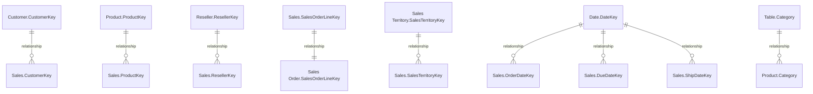

# 💎 Model - Advanced Data Dictionary

> **Generated:** 2026-01-31 07:38:45
> **Context:** This document is auto-generated from the model's metadata.

## 🔗 Relationship Map


## 📋 Model Blueprint
| Table Type | Table Name | Items | Description |
|:---:|---|:---:|---|
| 👤 **Dimension** | [Customer](#customer) | 7 | - |
| 👤 **Dimension** | [Date](#date) | 7 | - |
| 👤 **Dimension** | [Reseller](#reseller) | 8 | - |
| 👤 **Dimension** | [Sales Territory](#sales-territory) | 4 | - |
| 👤 **Dimension** | [Table](#table) | 2 | - |
| 📈 **Fact** | [Product](#product) | 10 | - |
| 📈 **Fact** | [Sales](#sales) | 16 | - |
| 📈 **Fact** | [Sales Order](#sales-order) | 4 | - |

---
## 📈 Factory Data (Facts)

### Product
*Path: `Product.tmdl`*

#### 📋 Columns
| Name | Type | Folder | Description |
|---|---|---|---|
| SKU | `string` | - | - |
| Product | `string` | - | - |
| Standard Cost | `double` | - | - |
| Color | `string` | - | - |
| List Price | `double` | - | - |
| Model | `string` | - | - |
| Subcategory | `string` | - | - |
| Category | `string` | - | - |
| Sorting = RELATED('Table'[Sorting]) | `unknown` | - | - |

### Sales
*Path: `Sales.tmdl`*

#### 📐 Measures

**📁 Other Measures**
<details><summary><b>Sales Amount by Due Date</b>: <i>No description provided</i></summary>

```dax
Sales Amount by Due Date = 
```
  	CALCULATE(SUM(Sales[Sales Amount]), USERELATIONSHIP(Sales[DueDateKey],'Date'[DateKey])) 
  	```
```
</details>

#### 📋 Columns
| Name | Type | Folder | Description |
|---|---|---|---|
| Order Quantity | `int64` | - | - |
| Unit Price | `double` | - | - |
| Extended Amount | `double` | - | - |
| Unit Price Discount Pct | `int64` | - | - |
| Product Standard Cost | `double` | - | - |
| Total Product Cost | `double` | - | - |
| Sales Amount | `double` | - | - |

### Sales Order
*Path: `Sales Order.tmdl`*

#### 📋 Columns
| Name | Type | Folder | Description |
|---|---|---|---|
| Channel | `string` | - | - |
| Sales Order | `string` | - | - |
| Sales Order Line | `string` | - | - |

---
## 👤 Business Context (Dimensions)

### Customer
*Path: `Customer.tmdl`*

#### 📋 Columns
| Name | Type | Folder | Description |
|---|---|---|---|
| Customer ID | `string` | - | - |
| Customer | `string` | - | - |
| City | `string` | - | - |
| State-Province | `string` | - | - |
| Country-Region | `string` | - | - |
| Postal Code | `string` | - | - |

### Date
*Path: `Date.tmdl`*

#### 📋 Columns
| Name | Type | Folder | Description |
|---|---|---|---|
| Date | `dateTime` | - | - |
| Fiscal Year | `string` | - | - |
| Fiscal Quarter | `string` | - | - |
| Month | `dateTime` | - | - |
| Full Date | `dateTime` | - | - |

### Reseller
*Path: `Reseller.tmdl`*

#### 📋 Columns
| Name | Type | Folder | Description |
|---|---|---|---|
| Reseller ID | `string` | - | - |
| Business Type | `string` | - | - |
| Reseller | `string` | - | - |
| City | `string` | - | - |
| State-Province | `string` | - | - |
| Country-Region | `string` | - | - |
| Postal Code | `string` | - | - |

### Sales Territory
*Path: `Sales Territory.tmdl`*

#### 📋 Columns
| Name | Type | Folder | Description |
|---|---|---|---|
| Region | `string` | - | - |
| Country | `string` | - | - |
| Group | `string` | - | - |

### Table
*Path: `Table.tmdl`*

#### 📋 Columns
| Name | Type | Folder | Description |
|---|---|---|---|
| Category | `string` | - | - |
| Sorting | `int64` | - | - |
