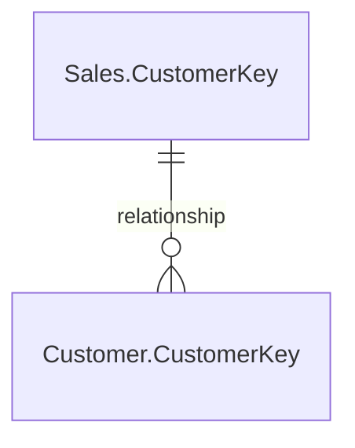

# AbinBev Theme File - Documentation

> **Generated:** 2026-02-01 20:41:48
> **Context:** This document is auto-generated from the model's metadata.

## 📑 Quick Navigation

- [Relationship Map](#-relationship-map)
- [Model Blueprint](#-model-blueprint)
- [Factory Data (Facts)](#-factory-data-facts)
- [Business Context (Dimensions)](#-business-context-dimensions)

---

## 🔗 Relationship Map

*Visual representation of how tables are connected in the data model.*



---

## 📋 Model Blueprint

*Overview of all tables, their types, and item counts.*

| Table Type | Table Name | Items | Description |
| 📈 **Fact** | [Customer](#customer) | 9 | - |
| 👤 **Dimension** | [Date](#date) | 7 | - |
| 👤 **Dimension** | [Product](#product) | 10 | - |
| 👤 **Dimension** | [Reseller](#reseller) | 8 | - |
| 👤 **Dimension** | [Sales Order](#sales-order) | 4 | - |
| 👤 **Dimension** | [Sales Territory](#sales-territory) | 4 | - |
| 📈 **Fact** | [Sales](#sales) | 16 | - |
| 👤 **Dimension** | [Table](#table) | 2 | - |

---

## 📈 Factory Data (Facts)

*Tables containing transactional data and metrics (measures).*

### Customer
*Path: `Customer.tmdl`*

#### 📐 Measures

**📁 Other Measures**
<details><summary><b>test measure</b>: <i>this is a test measure</i></summary>

</details>

<details><summary><b>another test measure</b>: <i>just a test measure</i></summary>

```dax
another test measure = 
```
  				"another test"
  	```
```
</details>


#### 📋 Columns

| Name | Type | Folder | Description |
| CustomerKey | `string` | - | - |
| Customer ID | `string` | - | - |
| Customer | `string` | - | - |
| City | `string` | - | - |
| State-Province | `string` | - | - |
| Country-Region | `string` | - | - |
| Postal Code | `string` | - | - |

---

### Sales
*Path: `Sales.tmdl`*

#### 📐 Measures

**📁 Other Measures**
<details><summary><b>Sales Amount by Due Date</b>: <i>Sales amount by Due Date</i></summary>

```dax
Sales Amount by Due Date = 
```
  				CALCULATE(SUM(Sales[Sales Amount]), USERELATIONSHIP(Sales[DueDateKey],'Date'[DateKey]))
  	```
```
</details>


#### 📋 Columns

| Name | Type | Folder | Description |
| SalesOrderLineKey | `int64` | - | - |
| ResellerKey | `int64` | - | - |
| CustomerKey | `int64` | - | - |
| ProductKey | `int64` | - | - |
| OrderDateKey | `int64` | - | - |
| DueDateKey | `int64` | - | - |
| ShipDateKey | `int64` | - | - |
| SalesTerritoryKey | `int64` | - | - |
| Order Quantity | `double` | - | - |
| Unit Price | `double` | - | - |
| Extended Amount | `int64` | - | - |
| Unit Price Discount Pct | `double` | - | - |
| Product Standard Cost | `double` | - | - |
| Total Product Cost | `double` | - | - |
| Sales Amount | `double` | - | - |

---

## 👤 Business Context (Dimensions)

*Reference tables providing context and descriptive attributes for analysis.*

### Date
*Path: `Date.tmdl`*


#### 📋 Columns

| Name | Type | Folder | Description |
| DateKey | `dateTime` | - | - |
| Date | `string` | - | - |
| Fiscal Year | `string` | - | - |
| Fiscal Quarter | `dateTime` | - | - |
| Month | `dateTime` | - | - |
| Full Date | `int64` | - | - |
| MonthKey | `int64` | - | - |

---

### Product
*Path: `Product.tmdl`*


#### 📋 Columns

| Name | Type | Folder | Description |
| ProductKey | `string` | - | - |
| SKU | `string` | - | - |
| Product | `double` | - | - |
| Standard Cost | `string` | - | - |
| Color | `double` | - | - |
| List Price | `string` | - | - |
| Model | `string` | - | - |
| Subcategory | `string` | - | - |
| Category | `string` | - | - |
| Sorting | - | - | - |

---

### Reseller
*Path: `Reseller.tmdl`*


#### 📋 Columns

| Name | Type | Folder | Description |
| ResellerKey | `string` | - | - |
| Reseller ID | `string` | - | - |
| Business Type | `string` | - | - |
| Reseller | `string` | - | - |
| City | `string` | - | - |
| State-Province | `string` | - | - |
| Country-Region | `string` | - | - |
| Postal Code | `string` | - | - |

---

### Sales Order
*Path: `Sales Order.tmdl`*


#### 📋 Columns

| Name | Type | Folder | Description |
| Channel | `int64` | - | - |
| SalesOrderLineKey | `string` | - | - |
| Sales Order | `string` | - | - |
| Sales Order Line | `string` | - | - |

---

### Sales Territory
*Path: `Sales Territory.tmdl`*


#### 📋 Columns

| Name | Type | Folder | Description |
| SalesTerritoryKey | `string` | - | - |
| Region | `string` | - | - |
| Country | `string` | - | - |
| Group | `string` | - | - |

---

### Table
*Path: `Table.tmdl`*


#### 📋 Columns

| Name | Type | Folder | Description |
| Category | `int64` | - | - |
| Sorting | `int64` | - | - |

---
